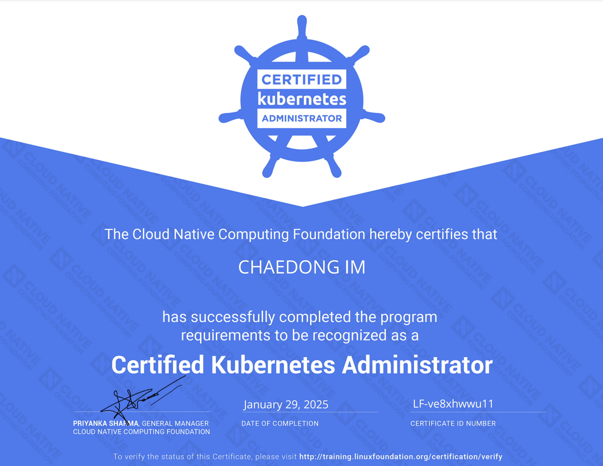

# CKA 자격증 취득 후기 (2025.01.29)

<figure><figcaption></figcaption></figure>

### 1. 개요&#x20;

약 1 달간 공부한 끝에 CKA를 취득했습니다. 공부 기간은 실무에서 사용경험이 없는 상태로 1달 평균 하루 2시간 가량 공부해 CKA에 합격했습니다.&#x20;

취득한 계기로는 DevOps 에 대한 관심과 큰 프로젝트라면 결국 사용하게 될 툴이라는 생각에 사내 프로젝트에선 사용하지 않더라도 미리 공부하고 싶어서 취득했습니다.

지난 AWS SAA 자격증 취득 때도 느꼈지만 자격증 공부가 필요없다고 말하기엔 생각보다 배우는 점도 많고, 동기부여에도 도움이 되는 편이라 앞으로도 자격증을 꾸준히 취득할 생각입니다.

### 2. 효용

자격증 그 자체에는 효용이 있을지 모르겠습니다. 다만 취득 과정에서 인강, hands on labs 를 통해 쿠버네티스에 대해 공부하게 되는 측면에선 효용이 크다고 생각합니다.&#x20;

간혹가다 채용 공고에 우대사항으로 CKA, AWS 자격증이 기재되 있는 부분을 보면 나름 공신력 있는 자격증이라는 생각도 있습니다 👍

### 3. 공부 방법

아래 유데미 강의 하나만 완강해도 됩니다. CKA 시험 난이도가 크게 어렵지 않고 "기초적인 개념 학습" "숙달된 실습 과정" "공식문서 활용 능력" 정도만 있으면 되기 때문에 유데미 강의만으로 충분히 취득 가능합니다.

특히 강의 중간중간의 hands on labs 와 Lightning Lab, Mock Exam 을  성실히 따라하면 CKA 시험은 합격이나 다름없습니다.

다만, 자격증 취득 그 자체만이 아닌 학습을 위해, 그리고 유데미만으로 부족한 부분은 따베쿠 유튜브 강의나 구글링을 통해 필요한 부분들을 그때 그때 채워나가면 좋을 것 같습니다. 특히 저는 Linux 와 Docker 에 대해 따로 공부를 많이 했습니다.

1. [유데미 강의 - Mumshad Mannambeth](https://www.udemy.com/course/certified-kubernetes-administrator-with-practice-tests/?srsltid=AfmBOoqg6XwC4-uAUJ8ru8UyxupLbwA74hZTdHb-LQU9CawcCxsZlDwB)
2. [유튜브 - 따베쿠](https://www.youtube.com/playlist?list=PLApuRlvrZKohaBHvXAOhUD-RxD0uQ3z0c)

### 4. 시험 Tip

1. 할인 팁 - 시험 응시할 때 유데미에서 제공하는 할인 쿠폰이나 구글에 cka coupon 등으로 검색해서 나오는 쿠폰으로 응시하시면 할인된 가격에 응시 가능합니다.
2. 준비 팁 - 시험 응시 후 제공되는 2번의 killer.sh 을 꼭 활용하시길 바랍니다. 시험 환경 적응, 공부용으로 아주 좋습니다. 각 세션마다 36시간만 접근 가능하니 주말 활용해서 사용하시면 좋을것 같습니다.

### 5. 마무리

CKA 를 취득했으니 CKS 공부를 시작할 생각입니다. CKAD를 먼저 취득하려 헀지만, CKA 공부를 하며 CKAD 공부까지 끝내버려 크게 도움되는 자격증은 아니라는 결론을 스스로 내렸거든요.. 😅&#x20;

CKS 는 CKA 에 비해 난이도가 높다고 하니 조금 더 재밌는 공부가 될 것 같습니다. 1 달로 가능할지 궁금하네요 🚀
